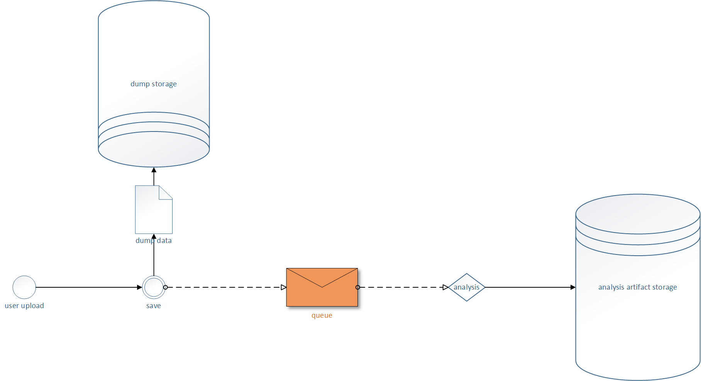

##`dumpling`
#####What is `dumpling`?

`dumpling` is the name of the DotNet dump analytics and storage service. Given a dump file, the service extracts information and catalogues it for future review.

#####The Vision
A runtime developer is looking for bugs to fix, and visits the `dumpling` website. They are presented with a view of the most impactful runtime issues. If they come across a failure they'd like to investigate, they may download the offending zipped up dump file and extract it to their machines for further review.

#####`The Status`The Pieces

1. Supported Users
   - Automated Infrastructure
   - Tools
   - Humans
2. `todo`[RESTful Front-End](rest.md)
   - **upload dump file**state-and-storage.md
   - Get Status
   - Retrieve Dump File
3. `todo` [Status Table](state-and-storage.md)
4. `todo` [**dump + runtime artifacts storage**](state-and-storage.md)
5. `stable`**analysis** Infrastructure
	- (**queue**) Azure Topic
	- Workers
		- Ubuntu 14.04 VM
		- CentOS VM
6. `todo` [**analysis artifacts storage**](state-and-storage.md)
7. `todo` Report Viewing
   - `todo` PowerBI for high-level status
   - `todo` ASP.Net WebViews for actionable data

#####The Gap Tasks
These are the remaining actionable tasks to meet the minimum-viable product of our vision.

1. Bring up SQL Database
    - `sschaabs` has a code-first Entity Framework base laid out that has withstood the test of time.
2. [Create REST Interface](rest.md)
	- (POST) AddDump
	- (GET) GetStatus
	- (GET) RetrieveDump
	- (POST/UPDATE) Update/AppendData
	- (methods) APIs for retrieving results to pre-defined SQL queries.
3. [Spawn State Table](state-and-storage.md)
4. Create web view that displays the results of our dumps.
	- Write SQL queries to be displayed
	- PowerBI (pass success)
	- Write HTML/JavaScript to be viewed.
	- Adjusted/Unadjusted mean time to failure.
 
